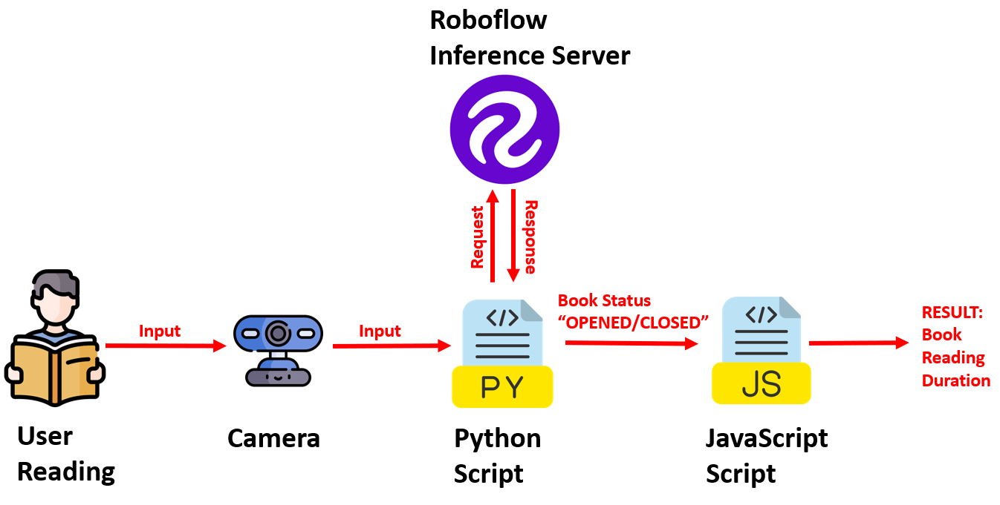

# book-reading-tracker

  
Book Reading Time Tracker is a computer vision project that tracks book reading time using object detection and MQTT communication.
  
Run <code>br_publisher.py</code> and <code>br_subscriber.html</code>
  
<h3>System Architecture</h3>

  
<h3>Output of the Project</h3>

